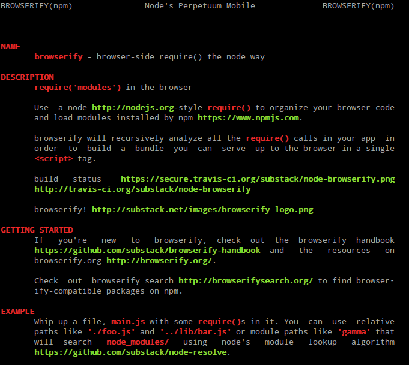

[](https://nodei.co/npm/npm-man/)

# npm-man

[![Dependency Status][david-badge]][david]

Fetches package's readme from the npm registry and renders it as a man page.

[david]: https://david-dm.org/eush77/npm-man
[david-badge]: https://david-dm.org/eush77/npm-man.png



## CLI

### `npm-man <package>`

Opens readme for `<package>` as a man page.

## API

#### `npmMan(packageName, cb(err, man))`

Fetches readme for `packageName` from the npm registry and returns it as a man page.

## Related

- [github-man] — open README from GitHub repository as a man page.
- [readman] - display local package readme as a man page.

[github-man]: https://github.com/eush77/github-man
[readman]: https://github.com/eush77/readman

## Install

```
npm install -g npm-man
```

## License

MIT
